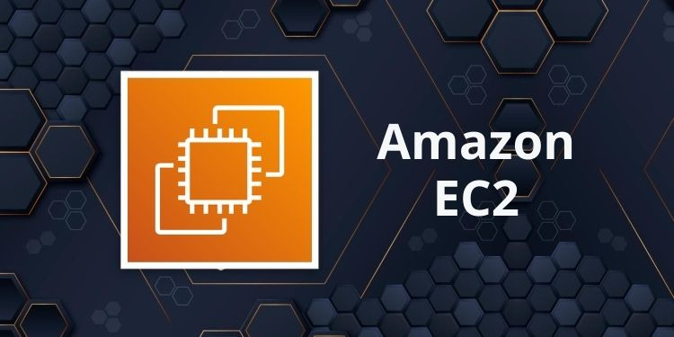

# Introdução ao AWS EC2

## O que é AWS EC2?
Amazon Elastic Compute Cloud (EC2) é um serviço da AWS que oferece **máquinas virtuais** na nuvem. Ele permite criar servidores sob demanda para rodar aplicações, com controle total sobre sistema operacional, armazenamento e rede.

## Conceitos Básicos
- **Instância**: Uma máquina virtual no EC2 (ex.: t2.micro, c5.large).
- **AMI**: Imagem de máquina da Amazon, um "template" com SO e configurações (ex.: Ubuntu, Windows).
- **Security Group**: Regras de firewall que controlam o tráfego de rede (ex.: liberar porta 80).
- **Chave SSH**: Par de chaves (.pem) para acesso seguro via terminal.

## Por que usar EC2?
- **Escalabilidade**: Ajuste recursos (CPU, RAM) conforme a necessidade.
- **Flexibilidade**: Escolha o SO e configure como quiser.
- **Pay-as-you-go**: Pague apenas pelo uso (com tier gratuito disponível).

## Como Criar uma Instância
1. No console AWS, vá para "EC2" > "Launch Instance".
2. Escolha uma AMI (ex.: Ubuntu 20.04).
3. Selecione o tipo de instância (ex.: t2.micro, gratuito).
4. Configure o security group (ex.: liberar portas 22 para SSH, 80 para HTTP).
5. Baixe o arquivo `.pem` (chave privada).

## Comandos Essenciais
- Conectar via SSH: `ssh -i chave.pem ec2-user@<IP_PÚBLICO>`
- Atualizar o sistema: `sudo apt update && sudo apt upgrade -y` (Ubuntu)
- Instalar Docker: `sudo apt install docker.io`

## Exemplo Prático
1. Crie uma instância EC2.
2. Conecte-se via SSH.
3. Instale o Docker: `sudo apt install docker.io -y`.
4. Rode uma aplicação: `sudo docker run -d -p 80:80 nginx`.
5. Acesse o IP público no navegador (ex.: `http://<IP_PÚBLICO>`).

## Casos de Uso
- Hospedagem de sites ou APIs.
- Ambientes de teste e desenvolvimento.
- Processamento de dados em larga escala.

## Recursos
- [Documentação EC2](https://aws.amazon.com/ec2/getting-started/)
- [AWS Free Tier](https://aws.amazon.com/free/)
